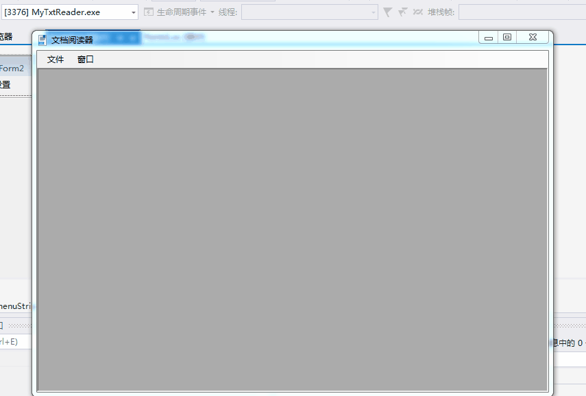
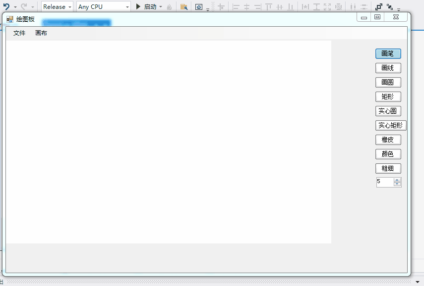
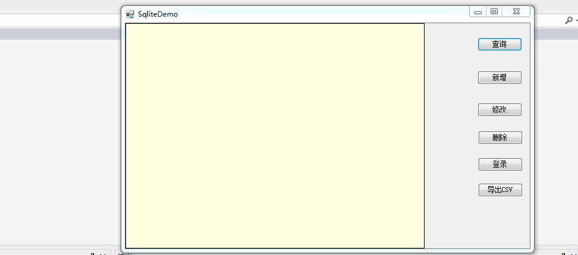

## C# 项目
使用Visual Studio 2019

### 1、绘图软件（winform）
介绍: 画基本的线和图形(圆形、矩形) ；自选颜色、设置画笔大小，橡皮擦的功能；打开、保存的功能；放大、缩小、清空画布。
演示：

### 2、TXT阅读器（winform）
介绍: 文本文件的分页阅读，可以个性化设置（分页、背景色、文字颜色、字体）；窗口的水平、垂直、层叠排序；
演示：

### 3、SqliteCurdDemo（winform）
介绍: 使用Sqlite数据库；包含增删查改、导出功能。
演示：

