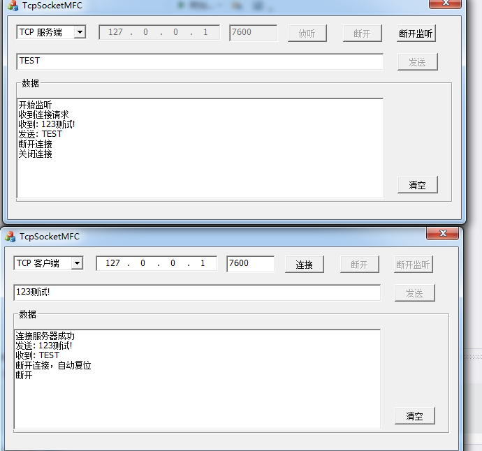
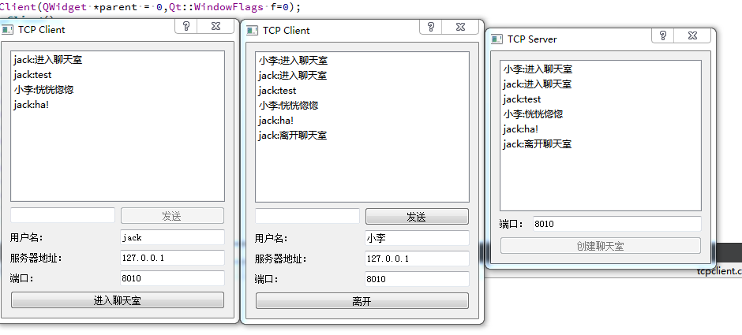
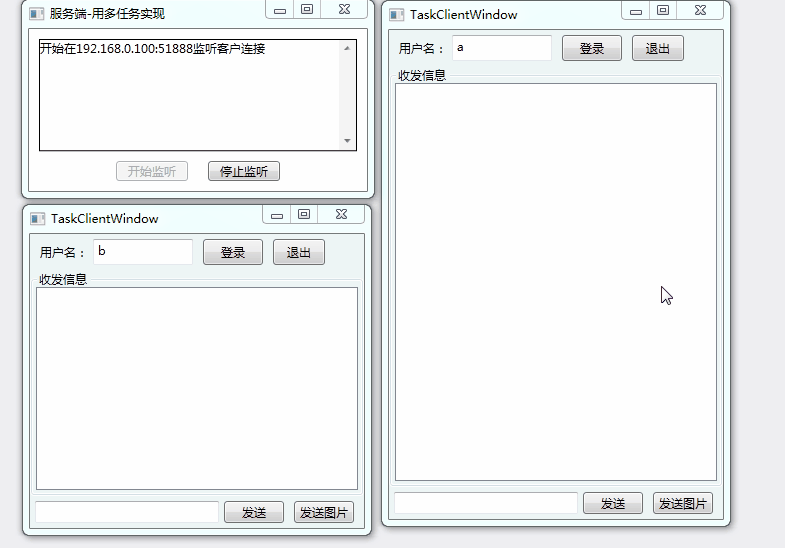

以下项目，开发环境为Qt5.14.2、Visual Studio 2019

## C++ 项目（MFC、Qt） 

### 1、TCP Socket通信(MFC)  
包含TCP Server和TCP Client。

演示：

### 2、网络聊天室(Qt) 
基于TCP协议的网络聊天室应用（TCP服务端、TCP客户端）

演示：

## C# 项目（winform、WPF）

### 1、绘图软件（winform）
介绍: 画基本的线和图形(圆形、矩形) ；自选颜色、设置画笔大小，橡皮擦的功能；打开、保存的功能；放大、缩小、清空画布。
演示：

### 2、TXT阅读器（winform）
介绍: 文本文件的分页阅读，可以个性化设置（分页、背景色、文字颜色、字体）；窗口的水平、垂直、层叠排序；
演示：

### 3、SqliteCurdDemo（winform）
介绍: 使用Sqlite数据库；包含增删查改、导出功能。
演示：

### 4、TCP应用（WCF、WPF）
介绍: 简单的多任务群发聊天程序(WCF、WPF)：服务端监听，转发消息；客户端登录、发送消息、图片的功能。
演示：

